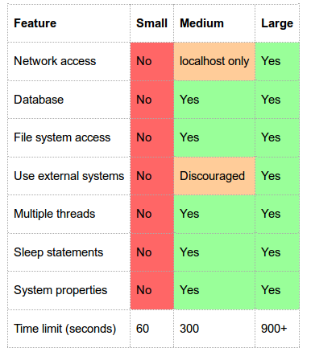
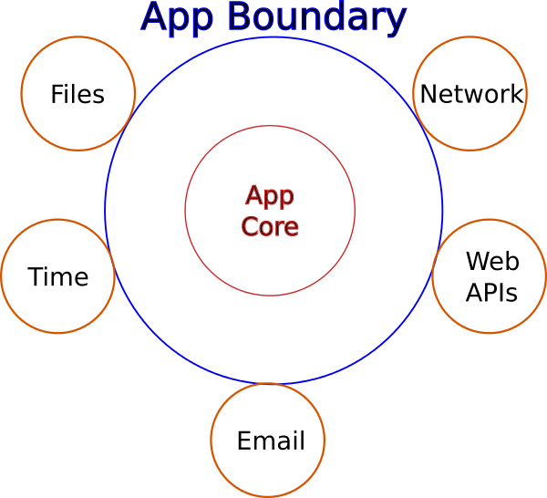
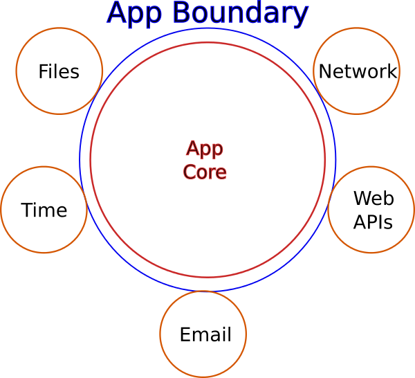
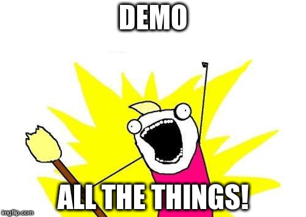

.. default-role:: code

===========================================
Testing Application Boundaries
===========================================

| By: Randy Syring
| Twitter: @RandySyring
| Email: randy.syring@level12.io
| https://github.com/rsyring/

.. epigraph::
    ...Software THAT WORKS!

.. image:: _static/level12-logo2.png

Introduction
==============

.. image:: _static/level12-logo.png
    :align: right

I'm the Chief Executive Developer at `Level 12`_.

Level 12 is a web & database development firm that uses:

- solid engineering,
- proactive communication, and
- modern development practices

to make our customers **really, really, happy.**

.. Level 12: https://www.level12.io/

Why it Matters to You
=====================

- Level 12 ... uses... **modern development practices**
- to make **our customers** really, really, happy

Net result: this works and is maintainable in the "real world"

Some Numbers
============================

- Biggest app:

    * 6+ years
    * 7,800 Python tests
    * 350 JS tests
    * 200+ DB tables
    * 91% code coverage

- Newer app: 1 year, 1,230 Python tests, 35+ DB tables, 95% coverage
- I practice what I preach

Test Types Overview
===================

* unit tests: isolate
* integration tests: multiple components
* functional tests: end to end testing
* acceptance tests: alias for functional tests?
* sytem tests: infrastructure dependent testing
* qa tests: let a human break it

Your definitions may differ.

Google's On To Something
========================

http://googletesting.blogspot.com/2010/12/test-sizes.html

Testing in Circles
==================

Minimze the DMZ
=========================

Two Principles
================

* Promote IO & side effects to the edge (make the core bigger)
* Using dependency injection, mocks, etc. in the DMZ

Examples Today
================

* File access
* Date/time
* Email
* Web API

Database is Core
================

* The database is usually too important to the application to consider it in the DMZ
* Google allowed DB access for their "medium" tests

Bring on the Code
=================

Code diffs: https://gist.github.com/rsyring

Thanks For Attending
======================

| By: Randy Syring
| Twitter: @RandySyring
| Email: randy.syring@level12.io
| https://github.com/rsyring/

Any questions?  I'd appreciate feedback.

